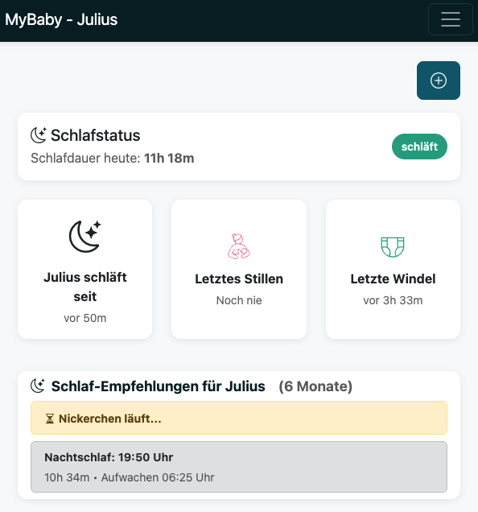
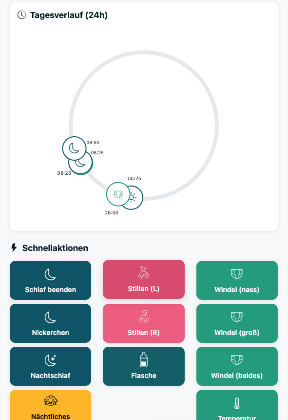
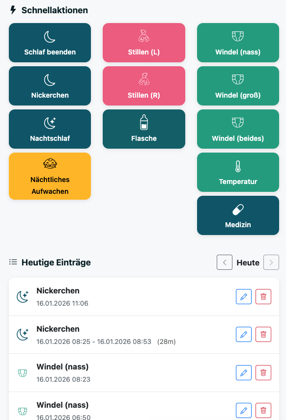
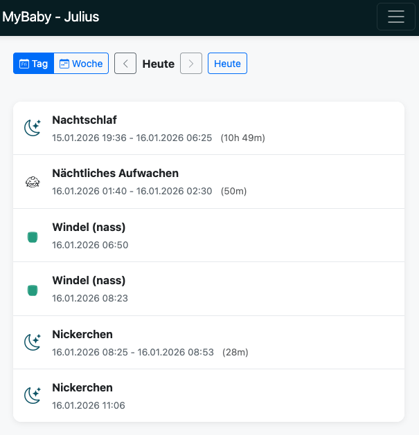
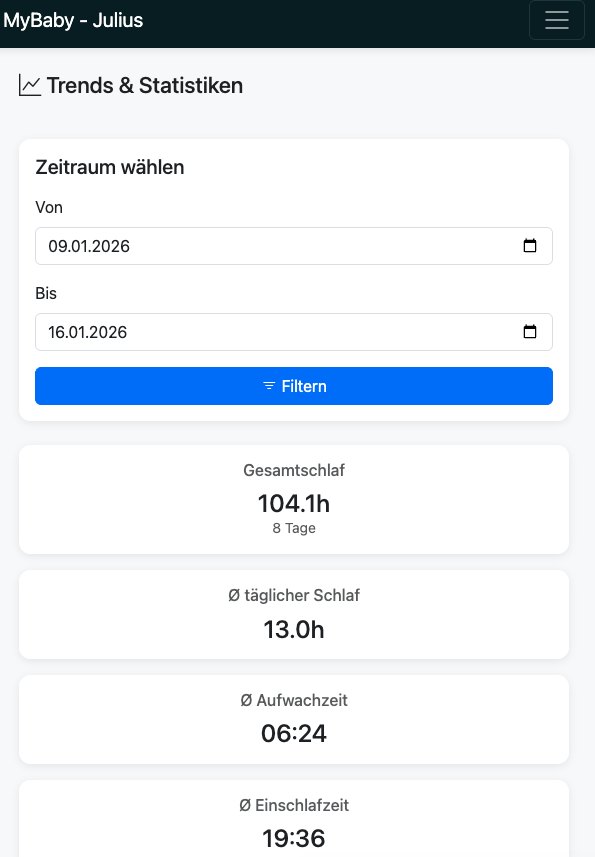
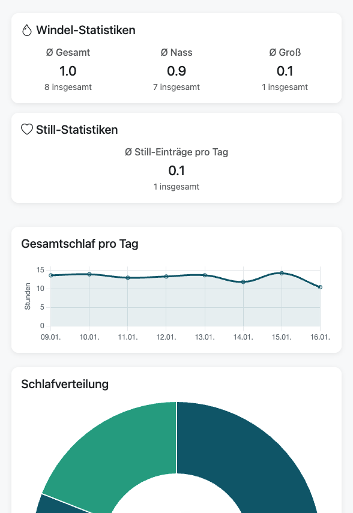
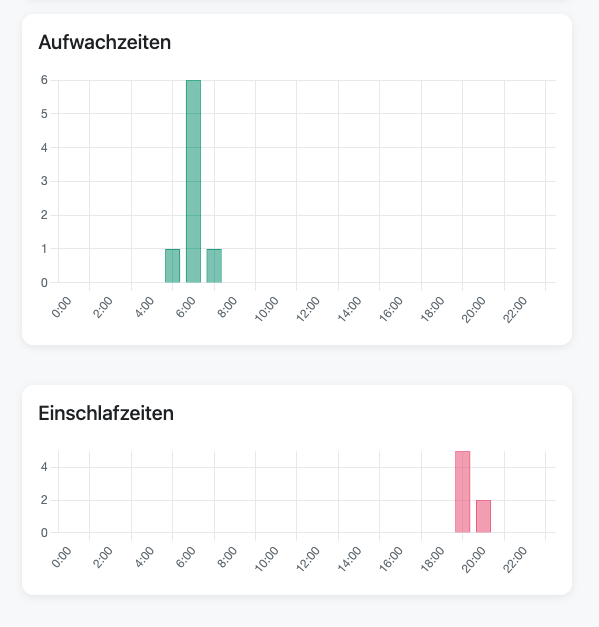
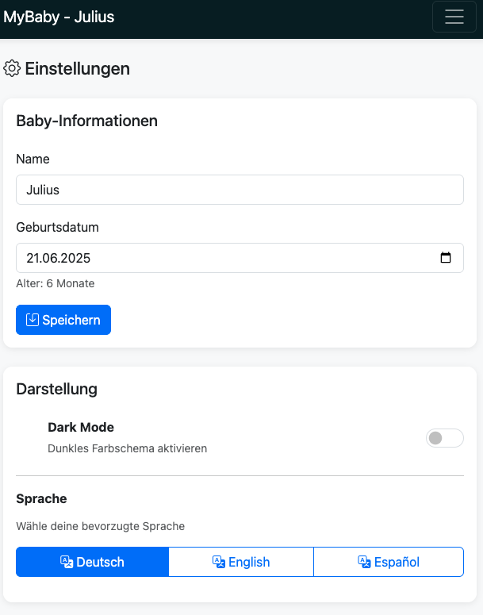

# MyBaby - Baby-Tracking App

Eine einfache und intuitive Web-App zum Tracking aller wichtigen Baby-Aktivitäten. Perfekt für den täglichen Gebrauch auf dem Smartphone oder Tablet.

## Was kann die App?

MyBaby hilft dir dabei, den Überblick über alle wichtigen Aktivitäten deines Babys zu behalten:

### 📱 Hauptfunktionen

- **Schlaf-Tracking**: Erfasse Nickerchen und Nachtschlaf mit automatischer Dauerberechnung
- **Einschlaf-Details**: Dokumentiere, *wie* (z.B. leicht, schwer, mit Weinen) und *wo* (eigenes Bett, Elternbett, auf dem Arm, Federwiege) dein Kind eingeschlafen ist – konfigurierbare Optionen in den Einstellungen
- **Nächtliches Aufwachen**: Dokumentiere nächtliche Wachphasen, die automatisch vom Nachtschlaf abgezogen werden
- **Intelligente Schlaf-Vorschläge**: Die App berechnet basierend auf Alter und Schlafmustern, wann das nächste Nickerchen und der optimale Nachtschlaf ansteht
- **Circular Timeline**: Visualisiere den Tagesverlauf als übersichtliches Kreisdiagramm
- **Stillen & Flasche**: Tracke Stillzeiten (links/rechts) mit optionaler Endzeit und Flaschenmengen
- **Windel-Tracking**: Dokumentiere Windelwechsel (nass/groß/beides)
- **Temperatur & Medizin**: Erfasse Fieberwerte und Medikamentengaben
- **Brei-Tracking**: Dokumentiere Breigaben mit Menge (g) und optionaler Nahrungsangabe
- **Gewichtstracking**: Erfasse das Gewicht deines Babys und verfolge die Wachstumskurve im Trends-Bereich
- **Größentracking**: Erfasse die Körpergröße deines Babys; Trends zeigt Gewicht und Größe kombiniert in einem Chart mit zwei Y-Achsen
- **Erkrankungen**: Dokumentiere Krankheitsphasen mit Typ, Symptomen und Notizen
- **Einträge-Übersicht**: Sieh alle Einträge in Tages- oder Wochenansicht
- **Trends & Statistiken**: Analysiere Schlafmuster, Windel- und Still-Statistiken, Temperaturverlauf sowie die kombinierte Wachstumskurve für Gewicht & Größe (mobil optimiert: Schnellfilter 7/30/90 Tage, einklappbare Bereiche, wischbare Chart-Reihe, größere Grafiken)
- **Mehrsprachigkeit**: Unterstützung für Deutsch, Englisch und Spanisch
- **Dark Mode**: Schonende Darstellung für die Nacht

### Screenshots

















### 🎯 Besondere Features

- **Intelligente Schlaf-Vorschläge**: Basierend auf wissenschaftlichen Empfehlungen (babyschlaffee.de) und dem Alter deines Babys. Berücksichtigt auch tatsächliche Schlafmuster aus der Vergangenheit
- **Visuelles Timeline-Diagramm**: 24-Stunden-Übersicht mit allen Aktivitäten auf einen Blick
- **Quick Entry**: Plus-Button oben auf dem Dashboard für schnellen Zugriff auf alle Eintragsmöglichkeiten
- **Mobile-optimiert**: Große Buttons für einfache, einhändige Bedienung
- **Persönlich**: Gib deinem Baby einen Namen - die App wird persönlicher
- **Mehrsprachig**: Wechsle zwischen Deutsch, Englisch und Spanisch in den Einstellungen
- **Lokal & sicher**: Alle Daten bleiben auf deinem Gerät, keine Cloud, keine Anmeldung
- **Zeitzonen & Zeiten**: Start- und Endzeiten aus dem Browser werden als UTC-ISO übermittelt und serverseitig nach Europe/Berlin normalisiert; das Dashboard-Datum „heute“ folgt ebenfalls Berlin. Beim Schlaf beenden wird die Gerätezeit mitgeschickt. Optionale Schlaf-Kommentare werden im Tagesverlauf und unter Einträgen angezeigt.

## Installation

### Schnellstart mit Docker (empfohlen)

Die einfachste Methode ist die Nutzung des vorgefertigten Docker-Images:

```bash
docker run -d \
  --name myBaby \
  -p 8000:8000 \
  -v $(pwd)/data:/data \
  sleepwalker86/mybaby:latest
```

Dann öffne im Browser: **http://localhost:8000**

### Mit Docker Compose

1. Lade die Dateien herunter (inkl. `docker-compose.yml`)
2. Starte die App:
   ```bash
   docker-compose up -d
   ```
3. Öffne im Browser: **http://localhost:8000**

Die Daten werden automatisch im `./data` Verzeichnis gespeichert.

### App stoppen

```bash
docker stop myBaby
docker rm myBaby
```

Oder mit Docker Compose:
```bash
docker-compose down
```

## Erste Schritte

### 1. Einstellungen konfigurieren

Gehe zu **Einstellungen** und trage ein:
- **Name des Babys** (optional, macht die App persönlicher)
- **Geburtsdatum** (wichtig für die Schlaf-Vorschläge)
- **Sprache**: Wähle zwischen Deutsch, Englisch oder Spanisch
- **Dark Mode**: Aktiviere für schonende Nutzung in der Nacht

### 2. Erste Einträge erfassen

Auf dem **Dashboard** findest du große Buttons für alle Aktivitäten:

- **Plus-Button** (oben rechts): Öffnet ein Modal mit allen Eintragsmöglichkeiten
- **Schlaf**: Starte ein Nickerchen oder den Nachtschlaf. Die App stoppt automatisch die Zeit.
- **Nächtliches Aufwachen**: Dokumentiere Wachphasen in der Nacht (wird automatisch vom Nachtschlaf abgezogen)
- **Stillen**: Wähle links oder rechts. Optional kannst du eine Endzeit eintragen, um die Stilldauer zu dokumentieren.
- **Flasche**: Gib die Menge in ml ein
- **Brei**: Erfasse Breigaben mit Menge und optionaler Nahrungsangabe
- **Gewicht**: Trage das aktuelle Gewicht ein – wird in der Wachstumskurve angezeigt
- **Windel**: Wähle nass, groß oder beides
- **Temperatur**: Trage die gemessene Temperatur ein
- **Medizin**: Erfasse Medikamentenname und Dosis
- **Erkrankung**: Dokumentiere Krankheitsphasen mit Start, Ende, Typ und Symptomen

### 3. Dashboard verstehen

Das Dashboard zeigt dir:

- **Aktueller Status**: Ist das Baby wach oder schläft es gerade?
- **Schlafdauer heute**: Gesamte Schlafzeit (Nachtschlaf + Nickerchen)
- **Letzte Aktivitäten**: Wann war das letzte Stillen, die letzte Flasche, etc.
- **Circular Timeline**: Visuelle Darstellung des Tagesverlaufs
- **Schlaf-Vorschläge**: Wann das nächste Nickerchen und der optimale Nachtschlaf empfohlen werden
- **Heutige Einträge**: Chronologische Liste aller Aktivitäten

### 4. Einträge durchsuchen

Die Seite **Einträge** bietet:

- **Tagesansicht**: Alle Einträge eines bestimmten Tages
- **Wochenansicht**: Übersicht über eine ganze Woche, gruppiert nach Tagen
- **Navigation**: Blättere zwischen Tagen und Wochen

## Tipps für die Nutzung

### Schlaf-Tracking

- **Nachtschlaf starten**: Wenn das Baby ins Bett geht, drücke "Nachtschlaf starten"
- **Nachtschlaf beenden**: Beim Aufwachen am Morgen "Schlaf beenden" drücken
- **Nächtliches Aufwachen**: Wenn das Baby nachts wach wird, starte "Nächtliches Aufwachen". Beim Wiedereinschlafen beende es. Die Dauer wird automatisch vom Nachtschlaf abgezogen.
- **Nickerchen nachtragen**: Du kannst auch Nickerchen mit angepasster Startzeit nachtragen
- **Einschlaf-Qualität & -Ort**: Beim Starten (und später beim Bearbeiten) von Nickerchen und Nachtschlaf kannst du festhalten, wie gut und wo dein Kind eingeschlafen ist. Die Optionen (inkl. Standardwerte) konfigurierst du in den Einstellungen.
- **Vorschläge beachten**: Die App berechnet basierend auf Alter und tatsächlichen Schlafmustern, wann das nächste Nickerchen und der optimale Nachtschlaf sinnvoll sind

### Schnellaktionen

- Alle Buttons sind für einhändige Bedienung optimiert
- Die App aktualisiert sich automatisch alle 60 Sekunden
- Einträge können später bearbeitet oder gelöscht werden

### Dark Mode

- Aktiviere den Dark Mode in den Einstellungen für schonende Nutzung in der Nacht
- Die App merkt sich deine Präferenz

## Wichtige Hinweise

- **Lokale Nutzung**: Die App läuft nur auf deinem Gerät/Server. Keine Cloud, keine Anmeldung nötig.
- **Daten-Sicherung**: Die Datenbank wird im `./data` Verzeichnis gespeichert. Regelmäßige Backups werden empfohlen.
- **Mobile Nutzung**: Die App ist für Smartphone-Nutzung optimiert. Funktioniert aber auch am PC.
- **Keine Internetverbindung nötig**: Die App funktioniert komplett offline, sobald sie gestartet ist.

## Häufige Fragen

**Wie funktionieren die Schlaf-Vorschläge?**
Die App nutzt wissenschaftlich fundierte Empfehlungen basierend auf dem Alter deines Babys. Sie berücksichtigt bereits gemachte Nickerchen, die Tageszeit und die noch empfohlene Tagschlafdauer. Für Nachtschlaf-Vorschläge werden auch die tatsächlichen Schlafmuster der letzten Tage berücksichtigt.

**Kann ich Einträge bearbeiten?**
Ja, alle Einträge können nachträglich bearbeitet oder gelöscht werden.

**Funktioniert die App offline?**
Ja, sobald die App gestartet ist, funktioniert sie komplett offline. Nur für den ersten Start (Docker-Image herunterladen) wird Internet benötigt.

**Wo werden die Daten gespeichert?**
Alle Daten werden lokal in einer SQLite-Datenbank gespeichert. Bei Docker-Nutzung im `./data` Verzeichnis.

**Kann ich die Daten exportieren?**
Die Datenbank-Datei kann direkt kopiert werden. Sie liegt im `./data` Verzeichnis.

**Welche Sprachen werden unterstützt?**
Die App unterstützt Deutsch (Standard), Englisch und Spanisch. Die Sprache kann in den Einstellungen umgeschaltet werden.

## Support

Bei Fragen oder Problemen:
- **GitHub**: [sleepwalker86/myBaby](https://github.com/sleepwalker86/myBaby)
- **Docker Hub**: [sleepwalker86/mybaby](https://hub.docker.com/r/sleepwalker86/mybaby)

## Lizenz / Nutzung

© 2025 Sascha Moritz

Der Quellcode darf für den **eigenen Gebrauch** angepasst und erweitert werden.

Eine **Weitergabe, Veröffentlichung oder kommerzielle Nutzung veränderter Versionen ist nicht gestattet**.

Wenn du den Code in einem anderen Kontext einsetzen willst (z. B. in einem Unternehmen oder als Open‑Source‑Projekt), kläre dies bitte vorher mit dem Autor.

---

## Haftungsausschluss

Dieses Projekt wird ohne Garantie bereitgestellt. Es gibt keine Gewähr für Richtigkeit, Vollständigkeit oder Eignung für einen bestimmten Zweck. Die Nutzung erfolgt auf eigene Verantwortung – insbesondere im Hinblick auf den Umgang mit sensiblen Daten.

